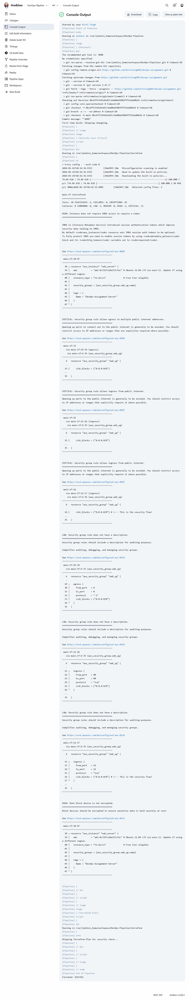
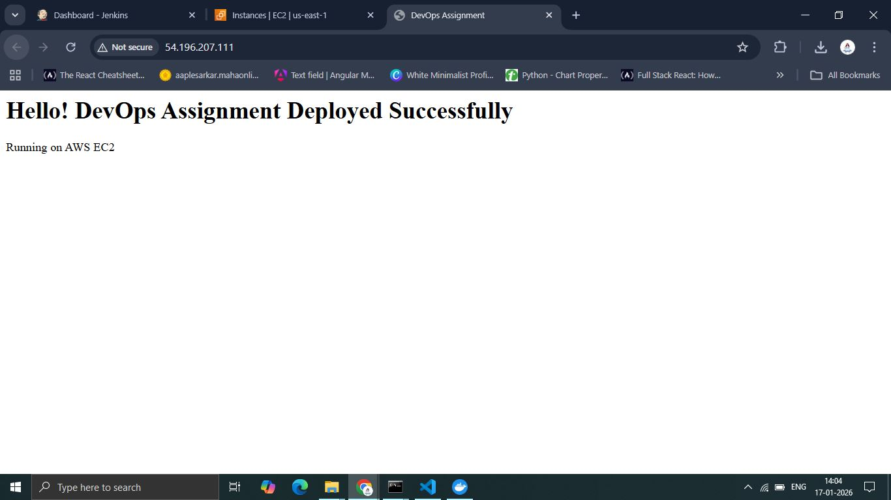

# Secure Cloud Infrastructure Deployment with AI Remediation

## 1. Project Overview
This project demonstrates a complete DevSecOps workflow. The objective was to provision secure cloud infrastructure on AWS, deploy a containerized web application, and automate security scanning using a CI/CD pipeline.

**Key Features:**
* **Infrastructure as Code (IaC):** AWS EC2 instance provisioned using Terraform.
* **CI/CD Pipeline:** Jenkins pipeline running in Docker to automate the checkout, scan, and plan stages.
* **Security & AI:** Integrated **Trivy** to scan infrastructure for vulnerabilities and used **Generative AI** to analyze reports and generate secure code fixes.

---

## 2. Architecture & Technologies
* **Cloud Provider:** AWS (Amazon Web Services)
* **Containerization:** Docker
* **Orchestration:** Terraform
* **CI/CD:** Jenkins
* **Security Scanning:** Trivy
* **AI Tool:** Gemini (used for remediation analysis)

---

## 3. Before & After Security Report

### **A. Initial Failing Scan (The "Trap")**
The initial Terraform code contained intentional vulnerabilities to simulate a real-world misconfiguration:
* **Port 22 (SSH)** was open to the public internet (`0.0.0.0/0`).
* **Root Volume** was unencrypted.

### **B. Final Passing Scan (The Fix)**
After applying the AI-generated fixes, the critical vulnerabilities were resolved. The security group was locked down, and encryption was enabled.

---

## 4. AI Usage Log (Mandatory)

**1. The Exact AI Prompt Used**
> "I have run a security scan using Trivy on my Terraform infrastructure code, and it failed with critical vulnerabilities. Below is the error report from the Jenkins console. Please analyze these errors, explain the security risks, and provide the corrected Terraform code to fix them."

**2. Summary of Identified Risks**
* **CRITICAL: Security Group allowed SSH from 0.0.0.0/0.** This exposes the server to brute-force attacks from anywhere in the world.
* **HIGH: Unencrypted Root Block Device.** Data stored on the root volume was at risk of being read if the physical drive was compromised.
* **HIGH: Missing IMDSv2 Token.** The instance metadata service was accessible without a token, increasing the risk of SSRF attacks.

**3. How AI-Recommended Changes Improved Security**
The AI provided a refactored `main.tf` that:
* **Restricted SSH Access:** Changed the ingress rule to allow SSH only from a specific trusted IP (`192.168.1.100/32` or the user's specific IP).
* **Enabled Encryption:** Added `encrypted = true` to the `root_block_device` block.
* **Enforced IMDSv2:** Added `http_tokens = "required"` to the metadata options.

---

## 5. Deployment Verification

### **Pipeline Success**
The Jenkins pipeline successfully checked out the code, passed the security scan (after remediation), and created the Terraform execution plan.

### **Application Running on Cloud**
The web application was automatically deployed using a User Data script and is accessible via the AWS Public IP.

Public IP - http://54.196.207.111/
---

## 6. Video Demonstration
*([Link to Video Recording](https://drive.google.com/file/d/1dB4L7RXw91HVDzBqFZ0Haxl5gjWEw8Dt/view?usp=sharing))*
